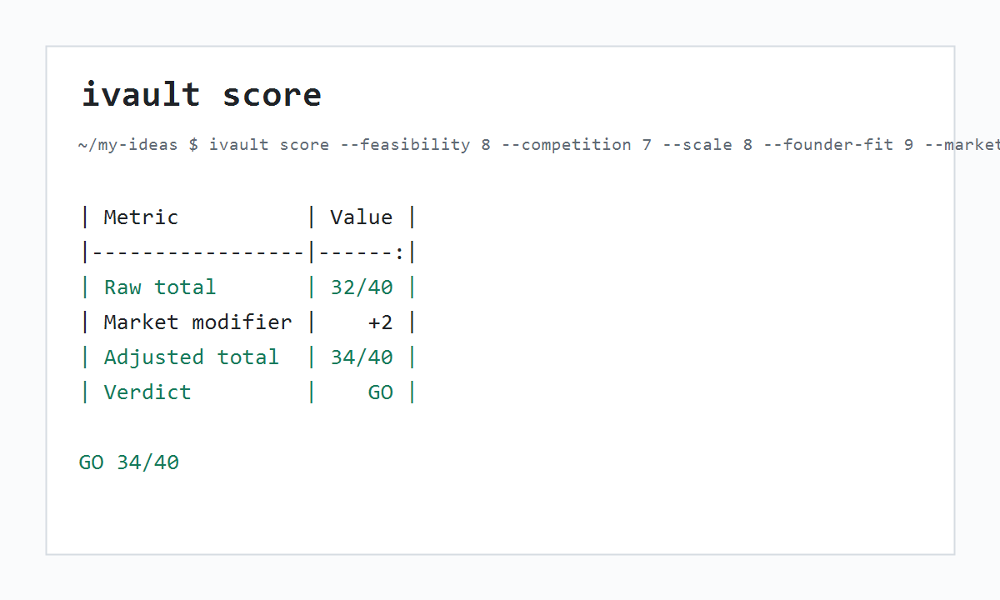
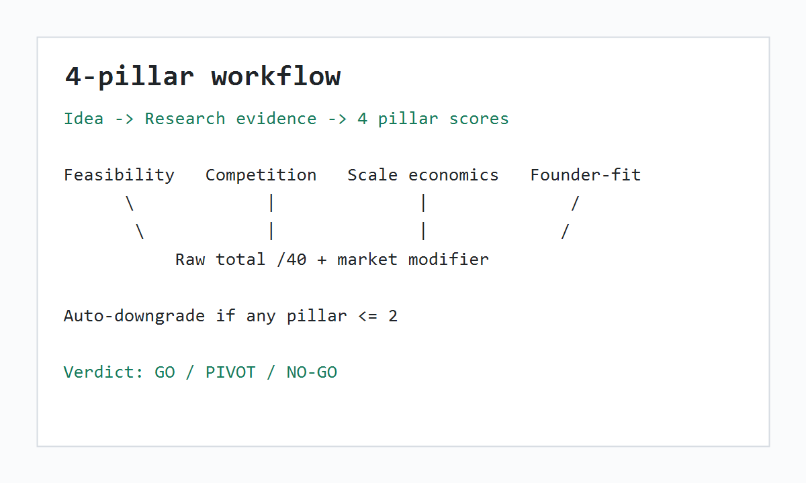
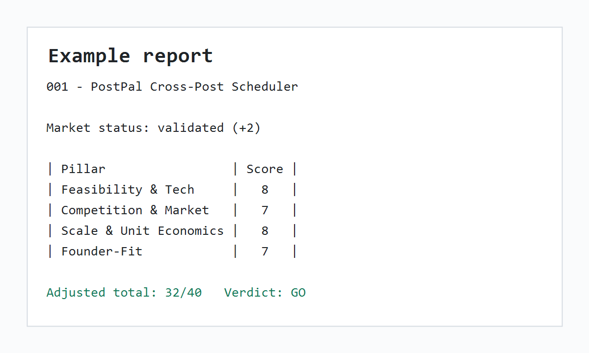

# ideas-vault-kit

> A 4-pillar method to kill 9 of every 10 side-project ideas before you write a line of code. Markdown vault + a tiny CLI + a copy-paste LLM prompt.

[](https://pypi.org/project/ideas-vault-kit/)
[](https://github.com/baronguyen001/ideas-vault-kit/actions/workflows/ci.yml)
[](LICENSE)
[](pyproject.toml)



```bash
pip install ideas-vault-kit
```

[See a worked GO example](examples/001-postpal-crosspost/README.md)

Ideas pile up in notes apps because every idea feels exciting when it is still vague. Then one of them eats three months before the boring problems appear: distribution, pricing, compliance, churn, or founder mismatch. This kit gives you a cold rubric instead of another list.

## The 4 Pillars

| Pillar | Core question |
|---|---|
| Feasibility & Tech | Can one person ship it without a major blocker? |
| Competition & Market | Is demand validated, and can you enter with a niche? |
| Scale & Unit Economics | Does each customer make sense as the business grows? |
| Founder-Fit | Does it fit your skills, channel, budget, time, and energy? |

Score each pillar from 0 to 10. Sum to `/40`, apply the market-status modifier, then decide:

| Adjusted score | Verdict |
|---:|---|
| 30-40 | GO |
| 15-29 | PIVOT |
| 0-14 | NO-GO |

Market status nudges the score: `validated` gets `+2`, `blue_ocean` gets `-2`, `crowded` gets `0`, `saturated` gets `-3`, and `dominated` gets `-5`. There is also an auto-downgrade: any pillar `<=2` means the idea can never be GO, even if the total is high.



## Two Ways To Run It

Manual CLI:

```bash
mkdir my-ideas
cd my-ideas
ivault new "AI receipt sorter for freelancers"

# Fill the markdown files yourself, then score it:
ivault score --write 001-ai-receipt-sorter-for-freelancers

# Or score non-interactively:
ivault score --feasibility 8 --competition 7 --scale 8 --founder-fit 9 --market validated

ivault index
ivault list --verdict GO
ivault rank                       # leaderboard sorted by /40 with a GO/KILL flag
ivault export --format csv        # dump every idea's scores + verdict to a file
```

`ivault` and `ideas-vault` are the same command; use whichever you prefer.

LLM prompt:

Do not want to research by hand? Paste [docs/prompt.md](docs/prompt.md) into Claude, Gemini, or GPT with your idea. It asks the model to research the market, fill the six files, score the pillars, and output an index row. The prompt is provider-agnostic and contains no SDK dependency. It works especially well with search-grounded models; for Gemini-oriented agent patterns, see [gemini-agent-toolkit](https://github.com/baronguyen001/gemini-agent-toolkit).

## AI-Assisted Scoring (Optional)

Stuck on a first guess? `ivault score "<idea>" --suggest` asks Gemini for a 0-10 score and a one-line rationale per pillar, plus a market-status guess. It is strictly advisory: it prints a table and the exact command to commit, but **you** still read the detail files and decide the numbers.

```bash
export GEMINI_API_KEY=...                  # bring your own key
ivault score "AI receipt sorter for freelancers" --suggest
ivault score "..." --suggest --model gemini-2.5-pro   # deeper analysis
```

This is opt-in and dependency-free: the CLI calls the Gemini REST API directly over the standard library, so the core install stays offline-first with no LLM SDK. With no key set, the command prints `set GEMINI_API_KEY to enable` and does nothing else.

## Leaderboard And Export

```bash
ivault rank                                 # all ideas, highest /40 first, GO/KILL flag
ivault compare 001 004 007                  # side-by-side comparison of selected ideas
ivault kill-list --threshold 15             # ideas below the kill line (archive/pivot shortlist)
ivault export --format json                 # writes ideas-vault.json into the vault
ivault export --format csv --output -       # stream CSV to stdout for a spreadsheet
ivault export --format obsidian --out vault/  # one note per idea + a ranked MOC, for Obsidian
ivault report --html board.html             # self-contained HTML scorecard for a launch post
ivault notion-sync                          # opt-in: push every idea into a Notion database
```

### Obsidian Export

```bash
ivault export --format obsidian --out my-vault/obsidian
```

Writes one markdown note per idea with Dataview-compatible frontmatter (score, verdict, market status, GO/KILL flag), `[[wikilinks]]` between ideas that share a market status, and a generated **Ideas MOC** note that ranks every idea by adjusted `/40`. Drop the folder straight into an Obsidian vault — no plugin required; Dataview just makes the fields queryable.

### HTML Leaderboard

```bash
ivault report --html board.html
ivault report --html board.html --title "My 2026 Shortlist"
```

Renders a single self-contained `.html` scorecard: every idea as a score bar with a GO/KILL badge, ranked highest `/40` first, with clickable column headers. No JS dependency, no network — a good artifact to attach to a launch post or share with a co-founder.

### Notion Sync (Optional)

```bash
pip install "ideas-vault-kit[notion]"       # adds the requests extra
export NOTION_API_KEY=...                    # internal integration token
export NOTION_DB=...                         # target database id
ivault notion-sync
```

Opt-in and bring-your-own-key. It upserts each idea as a row in a Notion database (the four-pillar score, verdict, market status, and GO/KILL flag), keyed by the idea folder name so re-running updates rows in place instead of duplicating them. With no key set, the command prints `set NOTION_API_KEY + NOTION_DB to enable` and does nothing else, so the core install stays offline-first with no extra dependency. The target database needs a title property `Name` plus properties `Idea Key`, `Number`, `Verdict`, `Flag`, `Market Status`, `Date`, and `Score`. See [.env.example](.env.example).

## Worked Example

[PostPal](examples/001-postpal-crosspost/README.md) is a synthetic GO example: cross-post build-in-public updates from one markdown file to X, Mastodon, and LinkedIn.

| Pillar | Score /10 |
|---|---:|
| Feasibility & Tech | 8 |
| Competition & Market | 7 |
| Scale & Unit Economics | 8 |
| Founder-Fit | 7 |
| **Raw total** | **30/40** |
| **Market modifier** | **+2** |
| **Adjusted total** | **32/40** |

The contrast example is [iOS apps for local restaurants](examples/002-ios-restaurant-apps/README.md), a public viral claim that the framework kills at 14/40 because App Store policy, saturated alternatives, and sales-channel mismatch matter more than a catchy revenue screenshot.



## Why Not a Notion Template?

This is git-tracked, so you can diff how your thinking changed. It forces a number, so vague enthusiasm has to become evidence. It has an auto-downgrade, so one fatal flaw kills the idea instead of hiding inside a high total. The default install works offline, has no account, calls no network, and stores nothing outside your own markdown vault. If you do live in Notion or Obsidian, the export adapters above push your scored ideas there on demand — without making the source of truth depend on a hosted account.

## Customize It

Edit your founder profile once in [templates/04-founder-fit.md](templates/04-founder-fit.md). Tune thresholds in [docs/scoring.md](docs/scoring.md) if your risk tolerance differs. Translate [templates/](templates/) if you want to evaluate ideas in another language; the framework is language-agnostic.

## Bigger Toolkit

This repo is intentionally small and offline-first. It sits next to the rest of the toolkit:

- [gemini-agent-toolkit](https://github.com/baronguyen001/gemini-agent-toolkit) — production patterns for Gemini-first Python agents (the LLM prompt and `--suggest` pair naturally with it).
- [confluence-scanner](https://github.com/baronguyen001/confluence-scanner) and [wallet-cluster-detector](https://github.com/baronguyen001/wallet-cluster-detector) — worked applications of the same `scrape -> score -> AI -> alert` loop.
- [ai-automation-skills](https://github.com/baronguyen001/ai-automation-skills) — free companion skills and learning material.
- [Trawlkit](https://github.com/baronguyen001/Trawlkit) — the paid starter kit that wires a Playwright scraper, cost-controlled Gemini, Telegram alerts, scheduler, and a `tk` CLI into runnable bots when you want the full automation loop, not just this rubric.

## Contributing

Issues and PRs are welcome for bug fixes, clearer docs, extra examples, and test coverage. Keep the project offline-first: no hosted service, no scraping dependency, no LLM SDK in the CLI.

## License

MIT.
